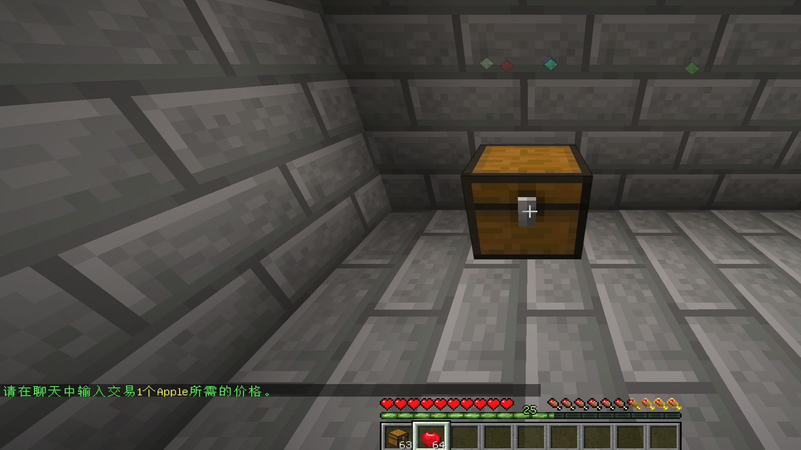
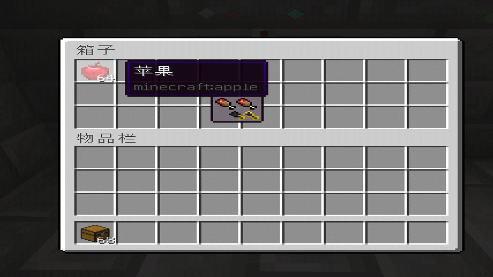
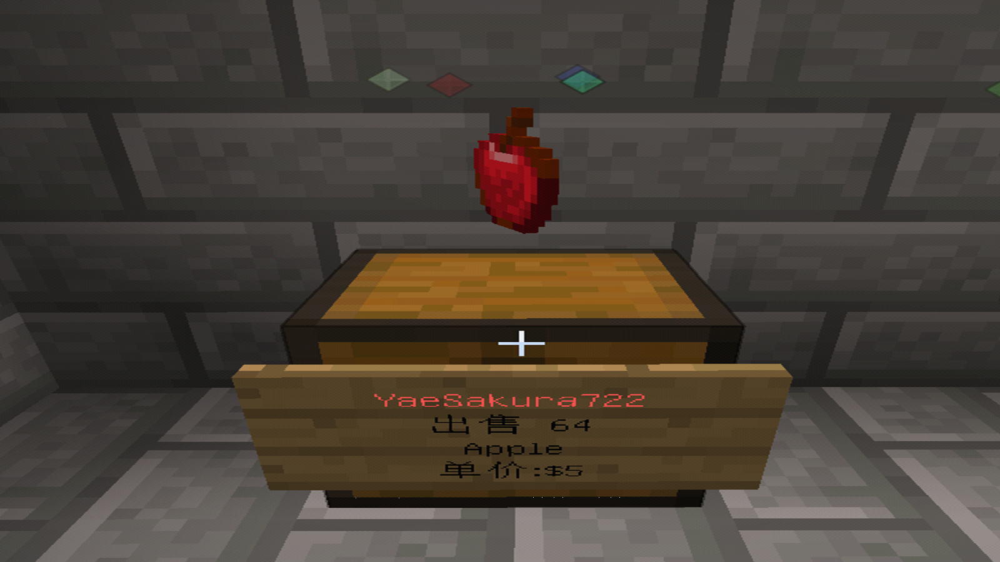
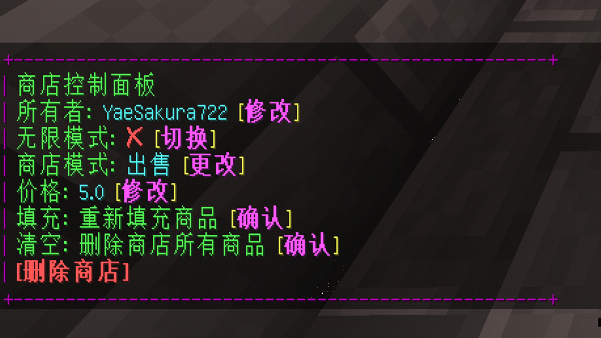
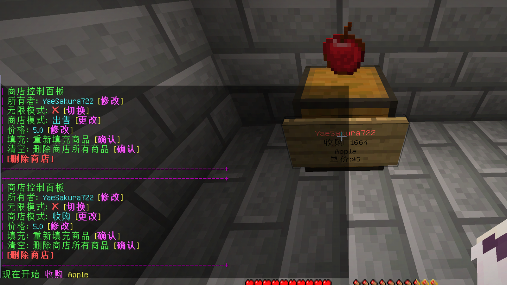

## 毛怪小镇基础指令教程

### 一、点歌插件（Allmusic3）

#### 1、基础点歌与搜索指令

```shell
# 搜索歌曲（支持歌曲名、歌手名）
/music search <关键词>
# 指定平台搜索（如 netease:晴天）
/music search <平台>:<关键词>
# 查看搜索结果下一页
/music nextpage
# 查看搜索结果上一页
/music lastpage
# 选择搜索结果中的歌曲（按序号）
/music select <序号>
# 直接通过歌曲 ID 点歌（如网易云歌曲 ID）
/music id <歌曲ID>
# 播放网络音频（如 MP3 链接）
/music url <音频URL>
```

#### 2、播放队列与控制指令

```shell
# 播放当前队列中的歌曲
/music play
# 暂停播放
/music pause
# 恢复播放（从暂停状态）
/music resume
# 停止播放并清空队列
/music stop
# 切换到下一首歌曲
/music next
# 切换到上一首歌曲
/music prev
# 查看当前播放队列
/music list
# 清空播放队列
/music clear
# 从队列中移除指定歌曲（按序号）
/music remove <队列序号>
```

#### 3、歌词与 HUD 显示指令

```shell
# 开启 HUD 显示（Lyric=歌词，Info=歌曲信息）
/music hud enable <类型>
# 关闭 HUD 显示
/music hud disable <类型>
# 调整 HUD 横向位置（如 /music hud Lyric x 100）
/music hud <类型> x <坐标>
# 调整 HUD 纵向位置（如 /music hud Info y 200）
/music hud <类型> y <坐标>
# 重置 HUD 位置为默认值
/music hud reset <类型>
# 启用/关闭全部界面
/music hud enable
# 重置全部界面
/music hud reset
# 启用/关闭单一界面
/music hud [位置] enable
# 设置某个界面的位置
/music hud [位置] pos [x] [y]
# 设置某个界面的对齐方式
/music hud [位置] dir [对齐方式]
# 设置某个界面的颜色
/music hud [位置] color [颜色HEX]
# 重置单一界面
/music hud [位置] reset
# 设置图片尺寸
/music hud pic size [尺寸]
# 设置图片旋转模式
/music hud pic rotate [开关]
# 设置图片旋转速度
/music hud pic speed [数值]
# 手动刷新歌词显示（解决卡顿问题）
/music lyric
```

#### 4、投票与互动指令

```shell
# 发起或参与切歌投票（达到阈值自动切歌）
/music vote
# 点赞当前播放的歌曲（增加热度）
/music like
# 点踩当前播放的歌曲（可能触发投票）
/music dislike
```

#### 5、歌单管理指令

```shell
# 查看服务器预设歌单列表
/music playlist list
# 将预设歌单加入播放队列（需在 config.yml 中定义）
/music playlist add <歌单名>
```

> 相关网站：https://www.mcmod.cn/class/14959.html

### 二、方块审计（CoreProtect）

```shell
# 空手点击方块，直接查看该方块的最近操作记录
/co i
# 按条件搜索记录（例：/co lookup [ID] time:9h，查找玩家在过去 9h 内破坏的方块及区块）
/co lookup <条件>
# 按条件回滚记录
/co rollback <条件>
# 撤销回滚操作
/co restore
```

### 三、全息文本插件（Holograms）

```shell
# 帮助
/holo help
# 查找文本列表
/holo list
# 传送到文本位置
/holo teleport
# 创建文本
/holo create
# 移除文本
/holo remove
# 复制文本
/holo copy
# 编辑文本
/holo edit
```

### 四、动作插件（Gsit）

```shell
# 坐
/sit
# 爬行
/crawl
# 趴着
/bellyflop
# 躺
/lay
# 转
/spin
```

### 五、传送插件

```shell
# 申请传送到指定玩家身边
/tpa <玩家名> <目标玩家名>
# 申请将指定玩家传送到自己身边
/tpahere <玩家名>
# 返回自己上一次死亡或传送前的位置
/back
# 返回到自己设置的某个家（需提前设置）
/home [家名称]
# 设置当前位置为某个家（可设置多个）
/sethome [家名称]
# 删除指定的家
/delhome [家名称]
# 返回世界出生点或服务器设置的全局出生点
/spawn
# 显示公共传送点
/warplist
# 传送到指定公共传送点
/warp <地点>
# 设置公共传送点
/setwarp <名称>
# 删除公共传送点
/delwarp <名称>
```

### 六、领地插件（res）

> 圈地工具为木锄头，左击选择第一个位置，右击选择第二个位置。

#### 1、总指令

```shell
# 查看帮助
/res ?
```

#### 2、领地创建与删除

```shell
# 创建一个领地
/res create [领地名]
# 删除一个领地
/res remove <领地名>
# 在所处的领地中创建一个子领地
/res subzone [子领地名]
# 自动以你站着的位置为中心，创建你能创建的最大领地
/res auto [领地名] [范围]
# 选取以你为中心需要被保护的区域（Z=高度，X/Y=横轴）
/res select [x] [y] [z]
# 显示所选区域大小
/res select size
# 显示已选择区域价格
/res select cost
# 打开自动选择区域
/res select auto [玩家]
# 选区向面对的方向扩展数值大小
/res select expand [数值]
# 从你面对的方向缩小领地
/res contract <领地> [缩小单位]
# 选区向面对的方向平移
/res select shift [数值]
# 高度从天空扩展到基岩
/res select vert
# 高度扩展到天框
/res select sky
# 高度扩展到基岩
/res select bedrock
# 选择目前所在区块
/res select chunk
# 使用 WorldEdit 的选区作为领地选区
/res select worldedit
# 为领地添加物理区域
/res area add [领地] [区域ID]
# 移除领地的物理区域
/res area remove [领地] [区域ID]
# 替换领地的物理区域
/res area remove [领地] [区域ID]
# 【注】可以与其他领地区域重叠
# 设置主领地
/res setmain <领地>
# 创建一个属于服务器所有的领地
/resadmin server [领地]
```

#### 3、领地权限与名称

```shell
# 向玩家添加基本权限
/res padd <领地名> [玩家]
# 删除玩家的基本权限
/res pdel <领地名> [玩家]
# 给不同的玩家设置权限
/res pset <领地名> [玩家] [权限] [true/false/remove]
# 在不同的领地内设置权限
/res set <领地名> [权限] [true/false/remove]
# 【注】以上两指令，不输入标志及其后面的内容可打开 GUI 面板
# 删除一个玩家所有权限
/res pset <领地> [玩家] removeall
# 重命名领地
/res rename [旧名称] [新名称]
# 【注】如果需要重命名子领地，必须使用全名称（主领地.子领地），而新名称不用全名称
# 从原领地复制权限到目标领地（前提是你为两个领地的所有者）
/res mirror [原领地名] [目标领地名]
# 在不同的权限组里设置标志
/res gset <领地名> [组名] [标志] [true/false/remove]
# 将领地的所有权限重置
/res reset <领地>
# 将某物品加入黑名单，以阻止这种物品被放置在领地中
/res lset <领地> [blacklist/ignorelist] [材料]
# 忽略名单选项
/res lset <领地> Info
```

#### 4、领地信息

```shell
# 自定义玩家进入或离开领地的消息
/res message <领地名> [enter/leave] [信息]
# 【注】enter=进入，leave=离开；信息可以是彩色（& 颜色代码）
# 显示目前所处的领地信息；如果在领地外使用，则显示自己的领地信息
/res info
# 列出玩家拥有的领地信息
/res list [玩家]
# 列出玩家所有领地
/res listall <页码>
# 列出领地的物理区域
/res area list [领地] <页码>
# 列出所有区域的坐标和详细信息
/res area listall [领地] <页码>
# 预定义的权限列表可以应用到领地上
/res lists
# 添加一个列表
/res lists add <列表名>
# 删除一个列表
/res lists remove <列表名>
# 将列表应用于领地
/res lists apply <列表名> <领地>
# 设置列表全局权限
/res lists set <列表名> <权限> <值>
# 设置列表玩家权限
/res lists pset <列表名> <玩家> <权限> <值>
# 设置列表组权限
/res lists view <列表名>
# 查看列表
/res lists view <列表名>
# 列出指定玩家拥有的隐藏领地
/res listhidden <玩家> <页码>
```

#### 5、传送相关

```shell
# 传送到指定领地
/res tp [领地名]
# 设置领地中的传送位置（设置后输入 /res tp [领地名] 将传送至该位置）
/res tpset
# 将你移动到你所在的领地外
/res unstuck
# 将你传送到世界上的随机位置
/res rt
```

#### 6、领地使用

```shell
# 显示领地的边界
/res show <领地>
# 管理领地银行
/res bank [deposit/withdraw] <领地> [数额]
# 【注】deposit=存款，withdraw=取款
# 从领地银行借贷
/res resbank [deposit/withdraw] [数量]
# 将所选领地给予另外一名玩家（该玩家须在线，且你是领地所有者）
/res give [领地名] [玩家]
# 设置指南针指向领地
/res compass <领地名字>
# 管理领地商店
/res shop
# 显示所有作为商店的领地
/res shop list
# 为领地商店评分
/res shop vote <领地> [分数]
# 为领地商店点赞
/res shop like <领地>
# 显示当前或指定领地商店的评分列表
/res shop votes <领地> <页码>
# 显示当前或指定领地商店的赞列表
/res shop likes <领地> <页码>
# 设置领地商店描述，支持颜色代码，用 /n 表示换行
/res shop setdesc [描述文字]
# 在选区位置建立商店宣传板，[位置] 表示宣传板的起始位置
/res shop createboard [位置]
# 右击宣传板的告示牌以删除宣传板
/res shop deleteboard
```

#### 7、领地聊天频道

```shell
# 加入当前领地或者指定领地的聊天频道
/res rc <领地>
# 如果你在一个领地频道内，你将会离开此频道
/res rc leave
# 设置领地频道文字颜色
/res rc setcolor [颜色代码]
# 设置领地频道前缀
/res rc setprefix [新前缀]
# 从频道中踢出玩家
/res rc kick [玩家]
```

#### 8、领地租赁相关

```shell
# 显示领地是否正在出租或出售，以及领地的花费
/res market Info [领地]
# 显示可出租与可出售的领地
/res market list
# 列举可以租用的领地
/res market list rent
# 列举可以出售的领地
/res market list sell
# 出售一个领地
/res market sell [领地] [售价]
# 将看向的木牌设置为领地市场木牌
/res market sign [领地]
# 如果该领地正在出售，则购买这个领地
/res market buy [领地]
# 取消出售领地
/res market unsell [领地]
# 租用一个领地
/res market rent [领地] <true/false>
# 【注】true 是开启自动续租；在领地所有者允许的情况下，领地将会在租约到期之前自动续租
# 以 [价格] 出租领地 [天数] 天
/res market rentable [领地] [价格] [天数] <true/false>
# 【注】如果为 true，领地将会在租约结束后自动出租
# 开关领地自动支付
/res market autopay <领地> [true/false]
# 支付租用的领地
/res market payrent <领地>
# 领地市场的确认操作
/res market confirm
# 删除可出租领地
/res market unrent [领地]
```

#### 9、插件相关

```shell
# 显示领地插件的版本
/res version
# 显示领地圈地和查看信息的工具类型
/res tool
```

### 七、QuickShop商店

#### 1、如何创建商店

（1）放置一个箱子，手持需要出售/收购的物品左键箱子，随后按照提示在聊天栏中输入价格。



（2）输入价格后打开箱子，往里面放置出售的物品即可完成创建。





#### 2、如何创建收购商店

（1）方法和上面一样，但是不需要往里面放入物品；创建好后右键告示牌。



（2）打开聊天栏，用鼠标点击「出售」后面的「更改」即可切换为收购商店。



#### 3、商店助手

```shell
# 管理此商店的商店助手
/qs staff
# 添加指定玩家为此商店的商店助手成员
/qs staff add <玩家名>
# 移除指定玩家为此商店的商店助手成员
/qs staff del <玩家名>
# 清空此商店的所有商店助手
/qs staff clear
# 查看此商店的商店助手成员列表
/qs staff list
```

> 助手可以帮你管理商店，有权限打开你的商店箱子、设置价格、设置出售与收购，但是不能移除你的商店，也不能从你的商店的交易中获得钱。

#### 4、指令清单

```shell
# 使您的店铺能够购买/出售无限量或有限量的商品
/quickshop unlimited
# 更换店主
/quickshop setowner <player>
# 将商店更改为购买物品
/quickshop buy
# 将商店更改为出售物品
/quickshop sell
# 调整商品的买入/卖出价格
/quickshop price <price>
# 移除所有已加载但无库存商品的店铺
/quickshop clean
# 找到最近的出售以所提供文本开头的商品的商店（例：/quickshop find dia 将找到最近的购买/出售钻石的商店）
/quickshop find <item>
# 从数据库中手动获取店铺信息
/quickshop fetchmessage
# 显示 QuickShop 信息
/quickshop info
# 启用/禁用调试模式
/quickshop debug
# 使用手头或指定的物品来创建商店
/quickshop create <price> [item]
# 指定商店所使用货币；经济插件必须支持多币种功能，并且需要得到 QuickShop 的支持（目前支持 GemsEconomy 和 TNE）
/quickshop currency <currency name>
# 在绕过所有保护检查的情况下开设一家店铺
/quickshop supercreate
# 收集有用信息并将其粘贴到 Pastebin 上
/quickshop paste
# 管理您店铺的员工
/quickshop staff
# 添加您店铺的员工
/quickshop staff add <player>
# 移除您店铺的员工
/quickshop staff del <player>
# 清除您店铺所有的员工
/quickshop staff clear
# 展示员工列表
/quickshop staff list
# 拆除所有破旧的商店
/quickshop cleanghost
# 将所有店铺数据导出到压缩文件中（仅控制台可用）
/quickshop export
# 从 TXT 文件或粘贴内容中恢复所有店铺信息（仅限控制台使用，可能会删除/覆盖您服务器上现有的任何商店，请先备份并在干净的数据库上尝试）
/quickshop recovery
# 修改批量大小（需在 config 中启用 allow-stacks 选项）
/quickshop size
# 清理旧店铺（需在 config.yml 中启用 purge 选项）
/quickshop purge
# 将所有店铺从一个玩家转移到另一个玩家
/quickshop transfer
# 更换店铺的商品
/quickshop item
# 移除特定世界中的所有商店
/quickshop removeworld
# 为店铺命名或取消特定名称
/quickshop name
# 调整每个店铺的权限，或将玩家添加到特定组中或从特定组中移除
/quickshop permission
# 查看并管理 QuickShop-Hikari 的状态
/quickshop database
# 查看并管理您的店铺优惠
/quickshop benefit
```

### 八、mcMMO

#### 1、技能管理

```shell
# 显示全服等级排名
/mctop
# 显示你的排名
/mcrank
# 显示你的等级
/mcstats（/stats）
# 展示你的实力水平
/mmopower（/mmopowerlevel、/powerlevel）
```

#### 2、技能详情

```shell
# 挖掘
/excavation
# 草药术
/herbalism
# 挖矿
/mining
# 伐木
/woodcutting
# 斧技
/axes
# 箭术
/archery
# 弩术
/crossbows
# 剑术
/swords
# 驯兽
/taming
# 三叉戟术
/tridents
# 格斗
/unarmed
# 杂技
/acrobatics
# 修理
/repair
# 钓鱼
/fishing
# 冶炼
/smelting
# 炼金
/alchemy
# 分解
/salvage
# 重锤术
/maces
```

#### 3、组队指令

```shell
# 加入一个组织
/party
# 传送至组织中的一名成员
/ptp
# 切换队伍聊天或发送队伍聊天消息
/partychat（/pc、/p）
```

#### 4、其他指令

```shell
# 打开/关闭 mcMMO 技能聊天显示通知
/mcnotify（/notify）
# 管理你的 mcMMO 积分榜（已禁用）
/mcscoreboard（/mcsb）
# 切换右键点击是否准备技能
/mcability
# 提供有关服务器兼容性和模式的信息
/mmocompat
```

> 相关网站：https://wiki.mcmmo.org/

### 九、菜单

```shell
# 打开菜单
/menu
```

### 十、RedEnvelope红包

```shell
# 领取指定的红包奖励
/re redeem <代码>
# 消耗余额发放红包
/re send <金额> <份数> <lucky|fixed> [广播]
```
